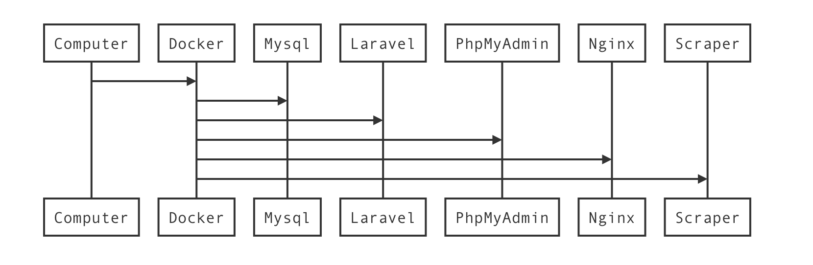
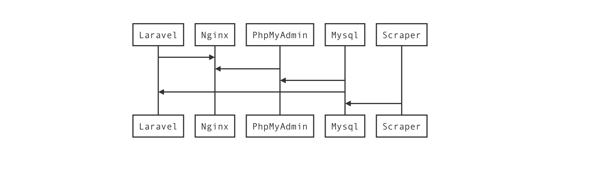
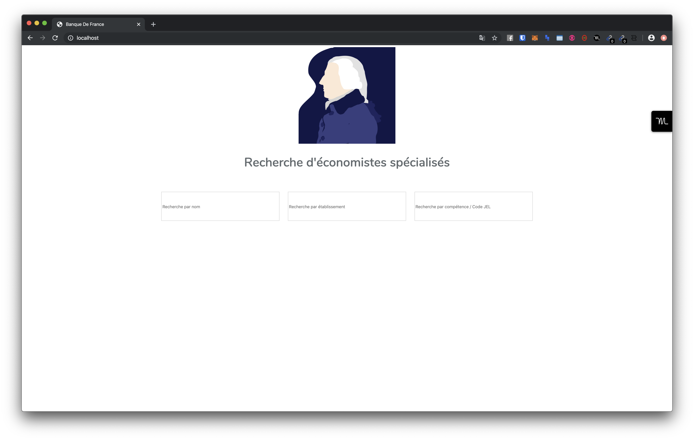
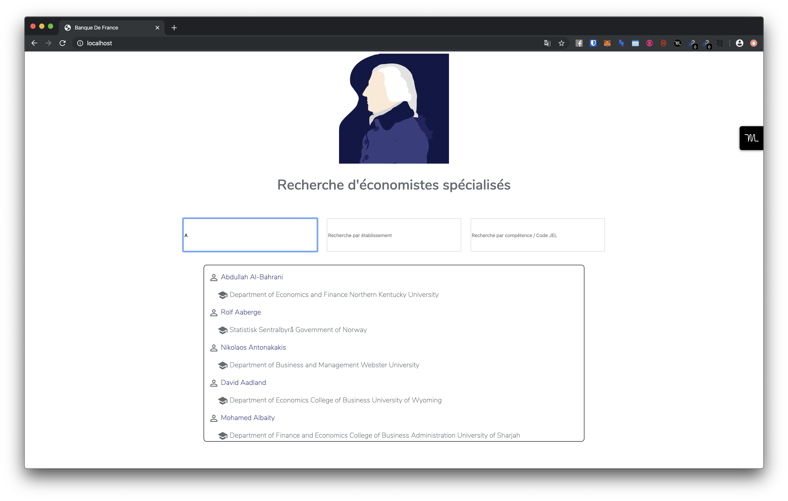
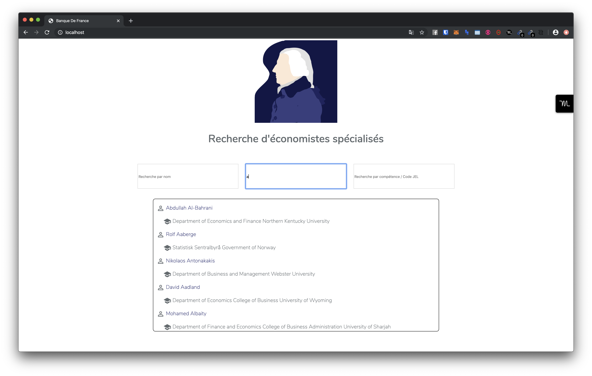
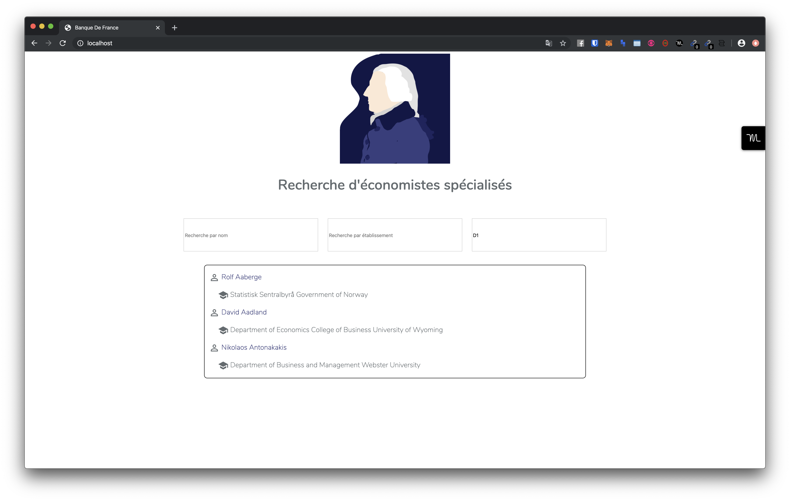
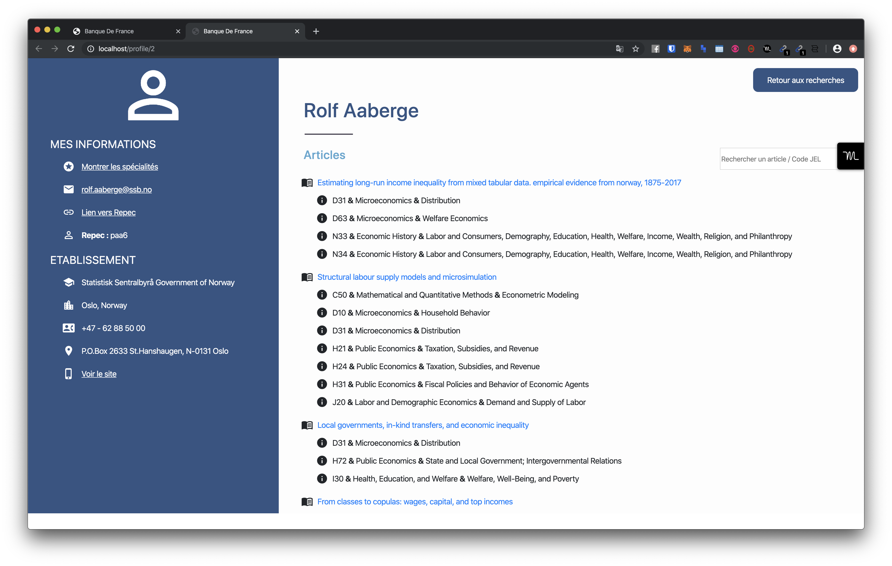
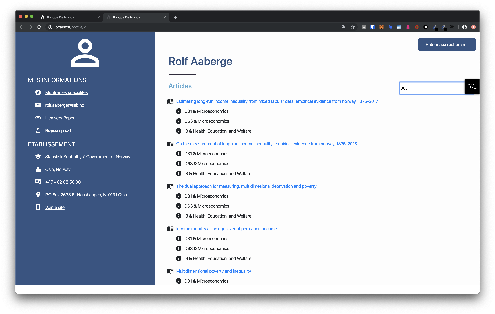
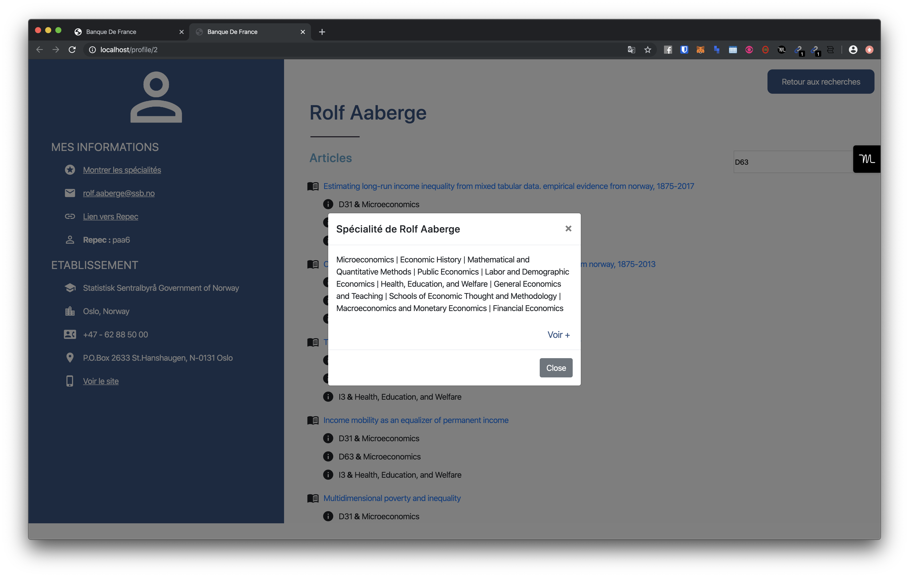
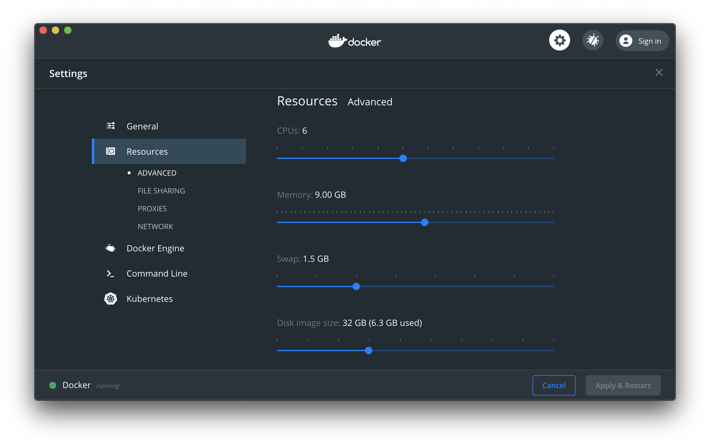

# Scrapping des Économistes.

Nous allons vous présenter ici l'application, le workflow, et sa composition.

#### Quelle est votre Stack technique ?

Nous avons choisi de construire l'application sur Docker, afin d'avoir un environnement de dev stable permettant au Jury ainsi qu'à nous-même (télétravail oblige en ces temps de Covid) d'avoir un OS commun.

> Ainsi, comme vous pouvez le constater, Docker contient l'entièreté de nos scripts, répartis dans 5 conteneurs représentés ci-dessous :



Voici une représentation succinte des interactions ayant lieu entre les conteneurs quand l'application, hébergée en local, est chargée sur votre navigateur



Nous avons aussi intégré, comme vous le verrez plus bas, un export des données sous format CSV


#### Quels ont été vos choix / contraintes ?

##### *Le rendu*

Comme dans tout projet, nous avons dû composer avec des ressources limitées : notre temps principalement. Nous avons donc fait des choix réfléchis afin de délivrer à l'utilisateur final une expérience de navigation de qualité, tout en réussissant à répondre à ce challenge en parallèle de nos études.

Ainsi, notre application a :

* Une interface web
* Un scraper asynchrone développé en Python
* Une fonction d'export en CSV (même si elle n'est pas très user-friendly)
* Une base de donnée consultable visuellement au travers de *Phpmyadmin*

***Nos choix***

*Partitionnement du projet*

Nous avons décidé de faire une application fonctionnant en 3 temps  : 

1. Un premier temps d'installation de Docker et de ses conteneurs (~30 minutes)

2. Un second temps de scraping de la data (30-35 heures en asynchrone)

3. Un dernier temps de navigation au travers de l'interface web (Quasi-instantané)

Ce choix de découpage a été décidé afin de permettre une expérience de navigation instantanée et possible sans internet une fois la base de donnée chargée. Étant donné qu'il ne devrait pas y avoir d'upload journalier de centaines de nouveaux articles, nous avons pensé qu'une mise-à-jour hebdomadaire, le weekend, ne serait pas dérangeante.

Sous cet angle, les 35 heures de scrapping seront transparents pour l'utilisateur. Libre à vous d'utiliser `Kubernetes`  ou ` Ansible` pour gérer le renouvellement hebdomadaire des informations.

*Scrapping*

Nous avons décidé de scrapper l'entièreté du site `Repec.org`. Sa classification JEL est très utile et permet de proposer une expérience de navigation optimale, codifiée, aux économistes désirant se renseigner sur leurs pairs.

Par ailleurs, beaucoup d'informations utiles y sont déjà répertoriées : `mail`, `universités` par exemple.

#### L'interface

Il est grand temps de maintenant vous présenter l'outil avec lequel vous allez pouvoir travailler :



Voici la page d'accueil. Simple, épurée, elle nous permet d'effectuer des recherches au travers de 3 critères : le `nom`, l'`établissement` et la `compétence`.

Une fois la requête tapée, l'affichage se fait immédiatement en Ajax, de façon fluide.



*<u>Requête par nom</u>*



*<u>Requête par établissement</u>*



*<u>Requête par code JEL</u>*


Une fois la recherche effectuée, il est possible de cliquer sur le nom d'un économiste. Nous naviguons ainsi vers sa page de profil



Sa page de profil permet de retrouver en un instant toutes les informations le concernant : adresse, ville, établissement, lien Repec ainsi qu'email.

Il y a par ailleurs au centre de la page la liste des articles de cet auteur, avec les classifications qui lui sont associées.

De plus, il est possible de filtrer les articles à l'intérieur d'un profil



Les spécialités d'un économiste sont à portée de quelques clics :



#### Comment démarrer l'interface ?

*Prérequis*

Étant donné que Docker consomme de base beaucoup de ressources, et que notre scrapper asynchrone est lui-aussi par la même occasion très intensif lorsqu'il est en activité, nous recommandons au moins 5 go de RAM + 4 coeurs. L'idéal serait de faire tourner l'application sur le cloud.

<u>*Voici les ressources sur lesquelles l'interface a été testée*</u>

*Démarrer l'interface*

```bash
1. Cloner le repo: `gcl https://github.com/themarch/hackaton_bdf.git` 
2. Aller dans le dossier: `cd hackaton_bdf`
3. Render le script d\installation exécutable: `chmod u+x script.sh`
4. Exécuter le script: `./script.sh`
-----
Attendre. 

Une fois tout terminé, vous aurez accès à l\'interface en tapant dans votre barre de recherche : `http://localhost`

Pour voir Phpmyadmin, entrez cette adresse : `http://localhost:7000`, user et mot de passe : `root` (sans guillemets)

```

*Exporter en CSV*

```bash
Pour exporter en CSV, 2 façons s\'ouvrent à vous :
1. Se connecter dans le conteneur `scrap` qui contient le `scrapper.py`, et l\'exécuter avec l\'option `--save`
2. Modifier le `./script.sh`, en rajoutant l\`option `--save` à la commande : `docker-compose exec $scrap python ./scraper.py`
```


Nous espèrons que cette documentation vous est exhaustive vous aiguillera dans la découverte et la délibération du jugement. N'hésitez pas à nous contacter si vous avez des questions
